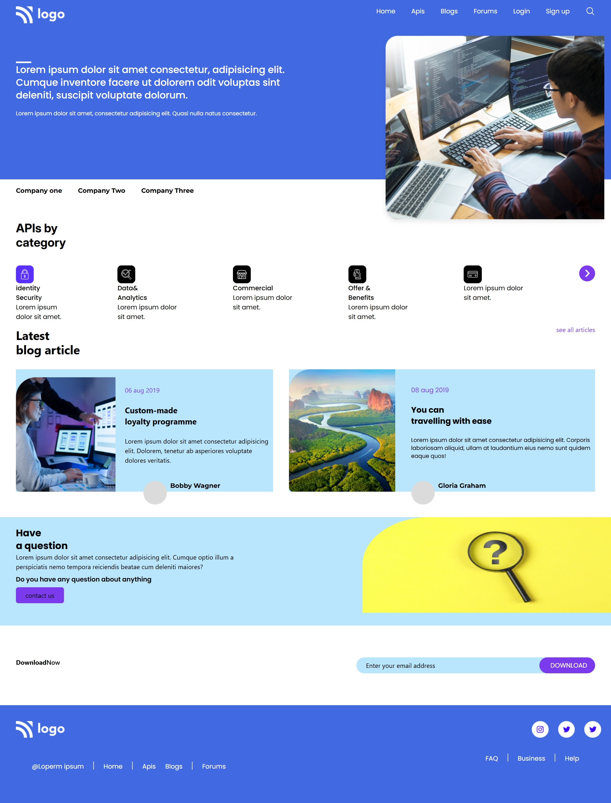

# 🚀 Developer Landing Page

A modern and responsive **Developer Landing Page UI** built using **HTML, Tailwind CSS, and Font Awesome**.
This project showcases a clean layout with multiple sections including navigation, APIs, blog articles, and a contact section.

---

## 📌 Features

* ⚡ Fully responsive design (Mobile, Tablet, Desktop)
* 🎨 Modern UI using Tailwind CSS
* 🔤 Google Fonts integration (Poppins, Inter, Montserrat, Michroma)
* 📱 Mobile-friendly navigation with menu icon
* 🧩 Multiple sections:

  * Navbar
  * Hero Section
  * API Categories
  * Blog Articles
  * Contact Section
  * Footer
* 🎯 Clean and structured layout

---

## 🛠️ Technologies Used

* **HTML5**
* **Tailwind CSS**
* **Font Awesome Icons**
* **Google Fonts**

PREVIEW



---

## 📂 Project Structure

```
project-folder/
│
├── index.html
├── images/
│   ├── Logo.png
│   ├── IMAGE HERE.png
│   ├── Group 97.png
│   ├── Rectangle.png
│   └── ...
```

---

## 🎨 Sections Overview

### 🔹 1. Navbar

* Logo on the left
* Navigation links (Home, APIs, Blogs, Forums)
* Mobile menu icon

---

### 🔹 2. Hero Section

* Eye-catching background
* Developer illustration
* Intro text

---

### 🔹 3. API Categories

* Displays different API categories:

  * Identity Security
  * Data & Analytics
  * Commercial
  * Offers & Benefits
  * Payment Methods

---

### 🔹 4. Blog Section

* Latest blog articles
* Author details
* Date and description

---

### 🔹 5. Contact Section

* Call-to-action area
* Button for contacting users

---

### 🔹 6. Download Section

* Email input field
* Download button

---

### 🔹 7. Footer

* Navigation links
* Social media icons

---

## 🚀 How to Run

1. Download or clone the project
2. Open `index.html` in your browser

```
git clone <your-repo-link>
cd project-folder
open index.html
```

---

## ⚙️ Tailwind Configuration

Custom fonts are configured in Tailwind:

```js
tailwind.config = {
  theme: {
    extend: {
      fontFamily: {
        poppins: ["Poppins", "sans-serif"],
        montserrat: ["Montserrat", "sans-serif"],
        michroma: ["Michroma", "sans-serif"],
        inter: ["Inter", "sans-serif"]
      },
    },
  },
};
```

---

## 📱 Responsive Design

| Device  | Status      |
| ------- | ----------- |
| Mobile  | ✅ Supported |
| Tablet  | ✅ Supported |
| Desktop | ✅ Supported |

